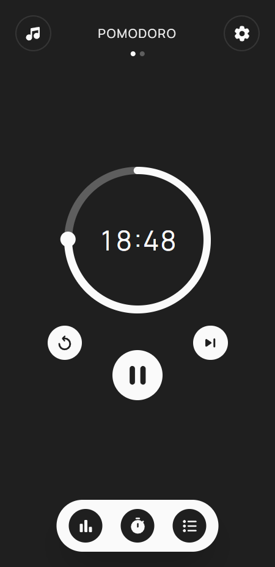
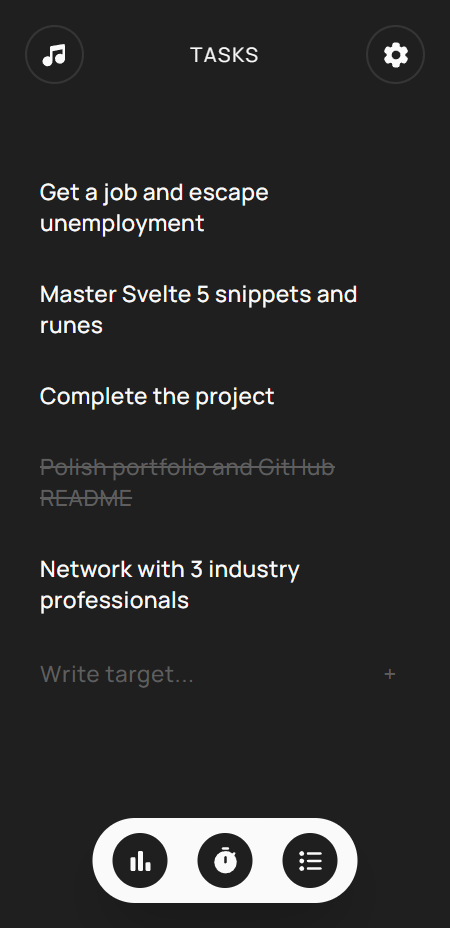
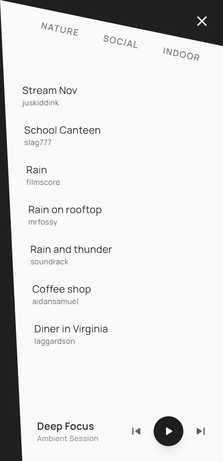
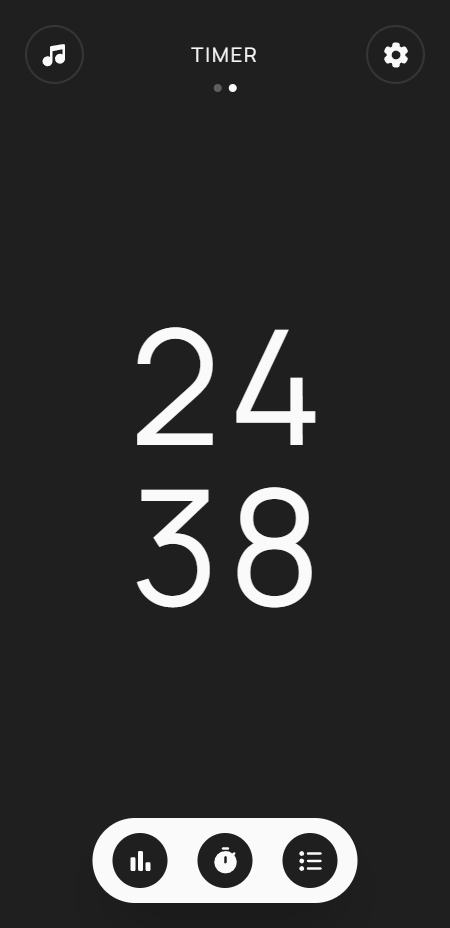

# Pomodoro

A responsive, offline-capable PWA featuring customizable Pomodoro and timer modes, task management, ambient background audio, productivity statistics, dynamic light/dark themes and buttery smooth animations.


## Features

* **Dual Timer Modes:** Classic Pomodoro technique intervals and standard countdown timer.
* **Integrated Task Management:** To-do list tailored for focus sessions.
* **Ambient Sound Player:** Built-in ambient white noise selection (rain, diner, coffee shop, nature) using lightweight `.opus` audio format.
* **Visual Productivity Stats:** Interactive charts and calendars tracking completed focus time.
* **PWA & Offline First:** Installable as a progressive web app with custom shortcuts and maskable icon assets.
* **Customizable Settings & Themes:** Adjustable work/rest cycles with seamlessly toggled light/dark themes.


## Screenshots

   


## Tech Stack

[](https://svelte.dev/)
[](https://www.typescriptlang.org/)
[](https://tailwindcss.com/)
[](https://vitejs.dev/)
[](https://developer.mozilla.org/en-US/docs/Web/Progressive_web_apps)


* **Framework:** [Svelte](https://svelte.dev/)
* **Language:** [TypeScript](https://www.typescriptlang.org/)
* **Styling:** [Tailwind CSS](https://tailwindcss.com/)
* **Build tool:** [Vite](https://vitejs.dev/)
* **Others:** PWA, sv-router


## Project Structure

```text
├── public/
│   ├── favicons/        # PWA maskable/monochrome icons
│   ├── screenshots/     
│   ├── shortcuts/       # Shortcut icons for PWA
│   └── white-noises/    
└── src/
    ├── components/      
    ├── routes/          
    ├── shared/          # Reactive Svelte stores (.svelte.ts)
    └── themes/          
```

## Installation

### Prerequisites

Make sure you have [Node.js](https://nodejs.org/) installed (v18 or higher recommended).

### Steps

Clone the repository and enter the directory

```bash
git clone https://github.com/LadyBeGood/pomodoro.git
cd pomodoro
```

Install dependencies using npm

```bash
npm install
```

Start the development server
```bash
npm run host
```


### Troubleshooting

These are some harmless issues related to tooling that do not affect the build:

- 
    In VS Code (at least), CSS files that use TailwindCSS specific *at rules* may give a warning such as: `Unknown at rule @theme in style.css`.
    
    If you want to remove those yellow squiggly lines:
    1. Make sure you've installed `Tailwind CSS IntelliSense` extension
    2. Go to the specific css file giving error.
    3. Press `Ctrl-Shift-P` to open **Command Palette**
    4. Search and Select **Change Language Mode**
    5. Search and Select **Tailwind CSS**

- Sometimes `tsconfig.json` file shows several errors related to config options. I have not found any solution on how to remove them. [Link to official issue](https://github.com/vitejs/vite/issues/18139).

## License
Copyright © 2026 LadyBeGood. All rights reserved.


